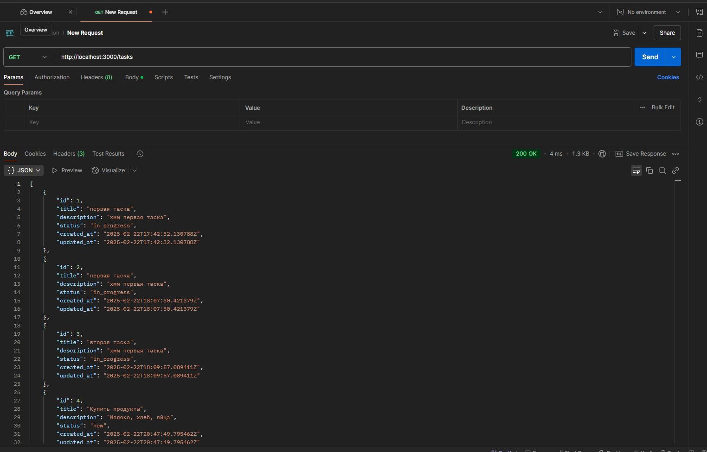
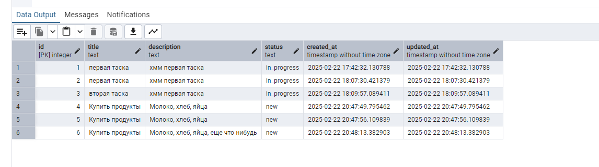
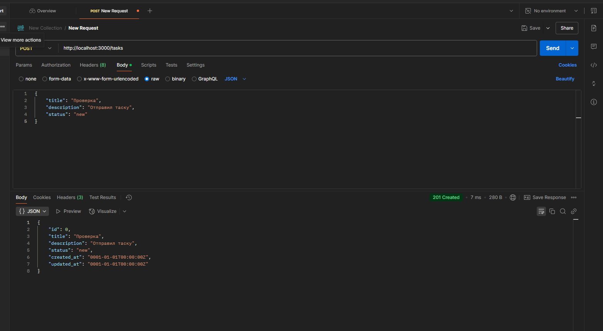
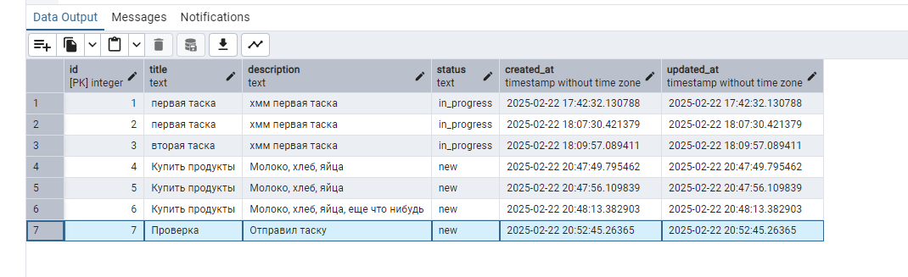
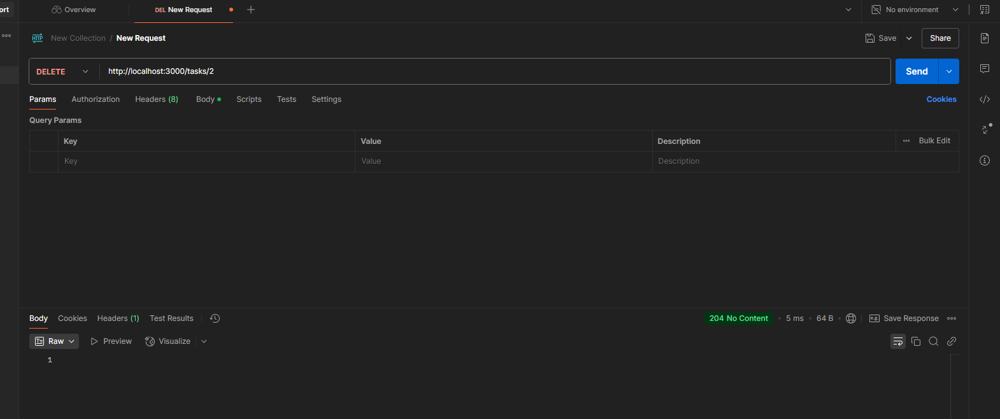
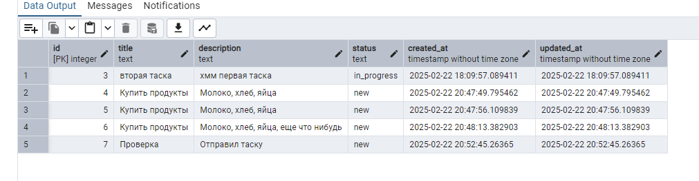
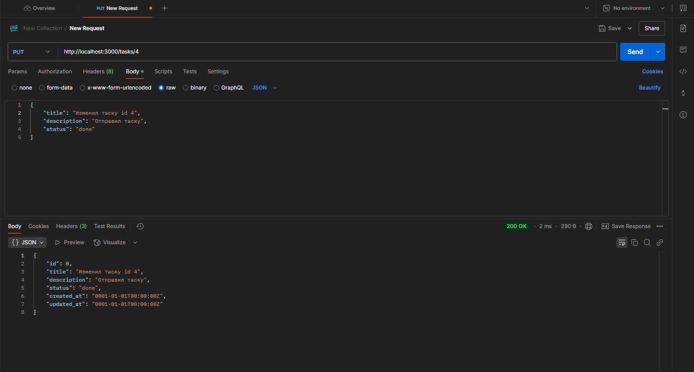
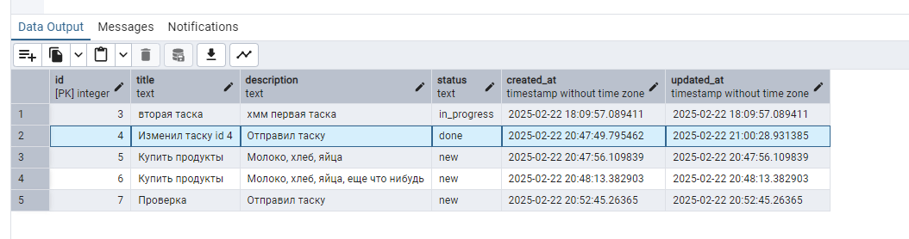
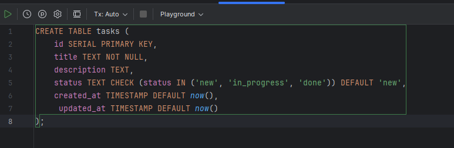

Для запуска используйте команду
docker-compose up --build

1)Сначала соберется образ приложения 

2)Запустит контейнеры для приложения и базы данных

3)Приложение открывается по адресу: http://localhost:3000

База данных PostgreSQL будет доступна на:
host: db

port: 5432

user: postgres

password: 12345

database: todo_db

Остановка проекта : docker-compose down

API-эндпоинты:
1) GET
   

2) POST

3) DELETE (удалил 1 и 2 таску)

4) PUT

В файле docker-compose.yml можно указать
services:
app:
build: .
ports:
- "3000:3000"
env_file:
- .env
depends_on:
- db
Так как файл уже явно объявлен в проекте